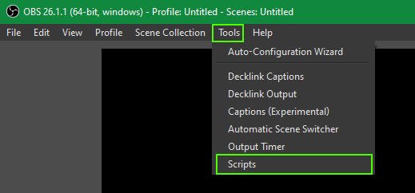
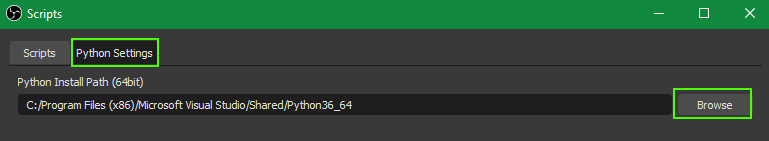
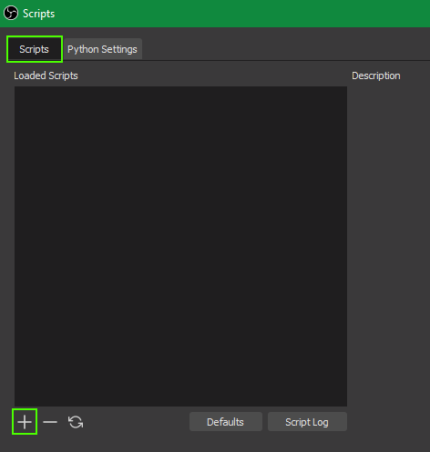

# OBS Python Scripts

A collection of Python scripts for [OBS Studio](https://obsproject.com/). These are pretty fun to make so hopefully people will ask me for some ideas of things they want.

## Setup

To use Python scripts in OBS Studio you must have Python 3.6 (as of the time of this writing), and make sure to match 32-bit Python with 32-bit OBS or 64-bit Python with 64-bit OBS.

In OBS Studio, hit Tools in the top menu bar and go to Scripts:

Switch to the Python Settings tab and browse to the **folder** where your Python install is (not the python interpreter itself like you have to do for some things). Please don't judge me for using the Visual Studio Python instance c':

Now simply hit the `+` button in the main Scripts tab to point to any scripts you might want to use in OBS. 

