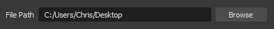

# PS_MultiCounter - PoodleSlayer's MultiCounter Script

This script allows you to easily increment and decrement multiple counter values in a `.txt` file, useful for displaying counts on a stream overlay that you can control via hotkeys.

## Setup

### OBS Setup

**Important:** make sure that you have done the [necessary setup for OBS](../../README.md) in order to use scripts. This is just installing the correct Python version and pointing OBS at the location, so nothing too crazy!

### File Path
Import the script into OBS Studio's Scripts manager. Before first-time use you **must** specify a folder in which to save the counter files. Currently this is written with Windows-style file system paths but ideally in the future I'll test this on all platforms that OBS supports.

### Hotkeys
In your OBS hotkey settings (File -> Settings -> Hotkeys) look for the entries labeled `PS_MultiCounter1 Up`, `PS_MultiCounter1 Down`, `PS_MultiCounter2 Up`, and `PS_MultiCounter2 Down`, probably near the bottom (I used a namespace to avoid the many other possible counter scripts that are out there). Specify the hotkeys of your liking and hit "Apply" and then "Ok".

## Using the Script

The counter files are created when you first specify a file path after loading the script for convenience. The script will also attempt to create the files each time it is re-loaded in case the files are deleted but the folder is still specified. If things don't seem to be working, just check the script log - I tried to write some helpful messages!

Once the script has been set up, simply use the hotkeys you specified to increase or decrease the counters. I added a check to prevent the counters from ever going below 0, but I can change this in the future to be more flexible if people want that.

Also for now this only supports two counters, however I am trying to think of a good way to handle a dynamic number of counters. This might not be feasible though, or at least not with OBS hotkeys since having 1 or 2 hotkeys per counter isn't a great UX. In this case it would probably be something driven by chat commands.